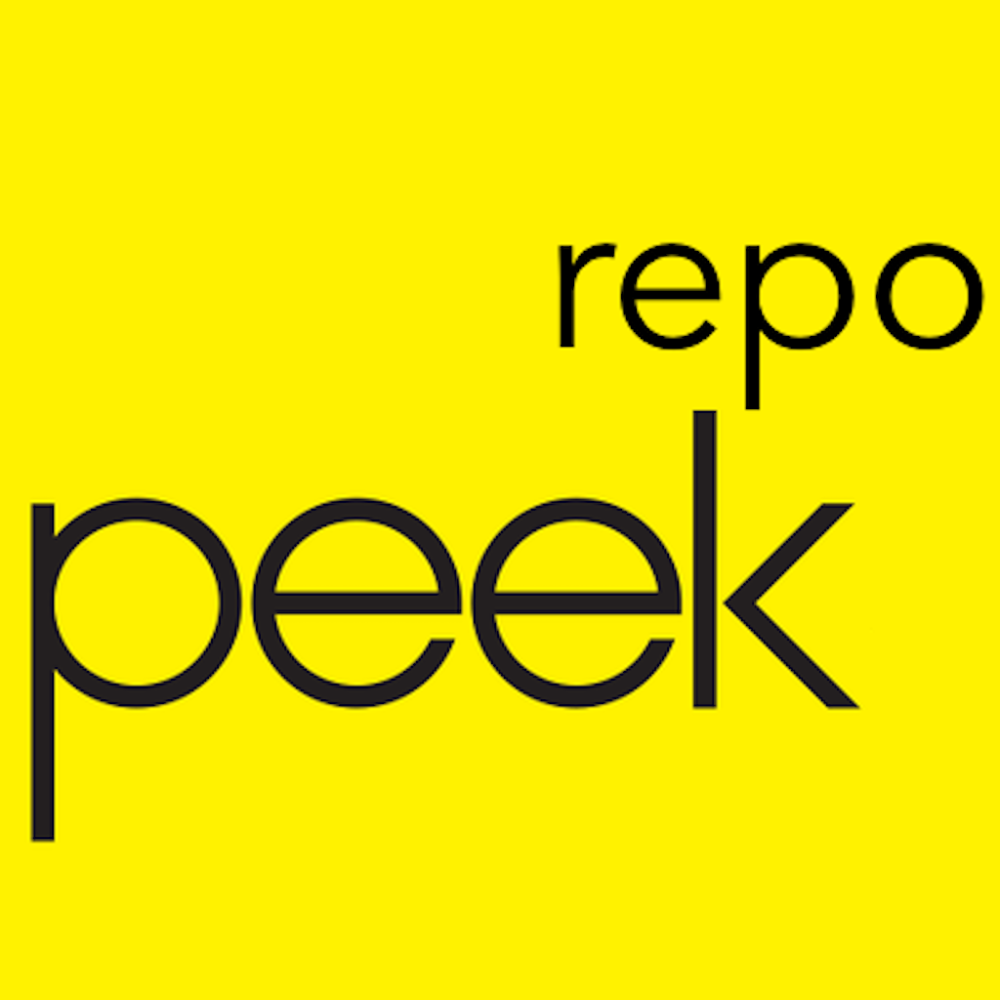
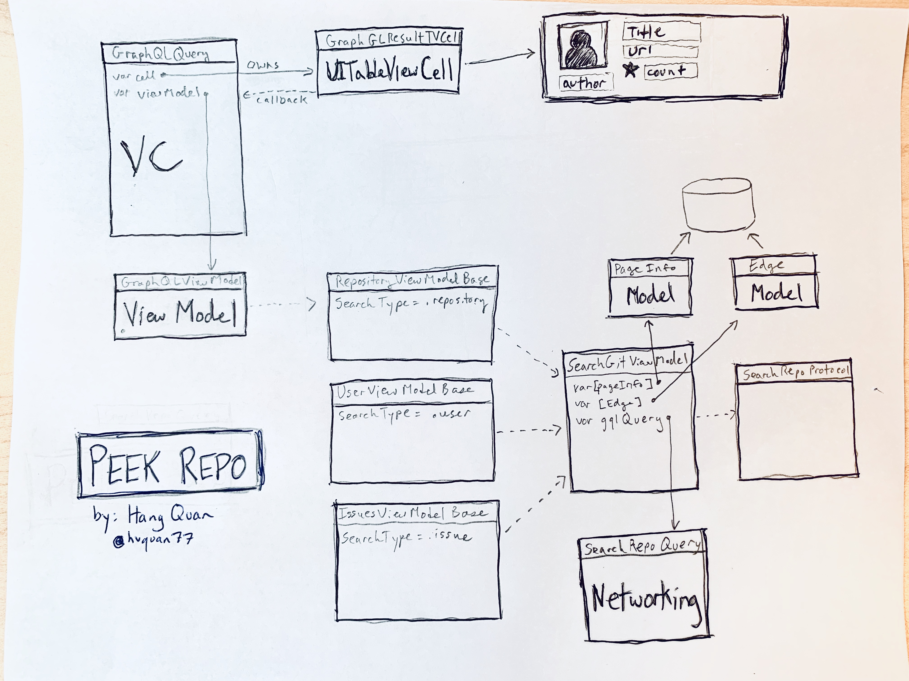
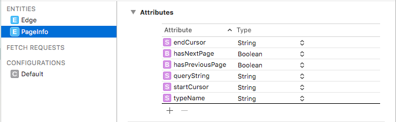
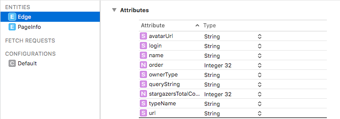

# Peek Repo



## Introduction
Introducing Peek Repo, a new way to view GitHub repositories on mobile! This app was created based on [The Peek iOS Coding Challenge](https://github.com/gadabout/github-graphql). 

On launch the app will display of list of repositories containing the string ```graphql```. The app currently supports the following features:

* Modern, responsive mobile experience
* Smooth pagenation for infinite amount of fun
* Pull to refresh the data
* Clicking on an item will take you to the GitHub repository

All this was designed using modern coding patterns and tools, including MVVM design, Interface Builder, Factory design patterns, protocols and with extensibility in mind.

## Dependencies
Since this is based on [The Peek iOS Coding Challenge](https://github.com/gadabout/github-graphql), this project interfaces with Github V4 APIs to perform searches.  The Search results are based off of the Search Result API found here.

The Manager classes were written as part of the standard template and it uses CocoaPods to leverage Apollo iOS Client to pull data from the Github API. 

## Setup

1. Make sure you have [Cocoapod](https://cocoapods.org/) installed on your dev box.
2. Clone this project.
3. Similar to [The Peek iOS Coding Challenge](https://github.com/gadabout/github-graphql), in order to pull data from Github API, please generate an access [token](https://help.github.com/articles/creating-a-personal-access-token-for-the-command-line/). The `githubToken` varaible will need to be updated the `GraphQLClientProtocol.swift` file.
3. From your git repo folder: ```pod update```
4. Build and run

### Troubleshooting
If you run into issues, here are some helpful tips that could unblock you:

* Error: [Latest version of apollo-ios does not support Apollo-Cli 1.9.x](https://github.com/apollographql/apollo-ios/issues/374) 
* Error: [The version of Apollo.framework in your project requires Apollo CLI 1.2.0...](https://github.com/apollographql/apollo-ios/issues/334)
	* ```$ npm install -g apollo```
	* ```$ rm -rf node_modules```
	* ```$ pod install```
* Error: Package.json not found during Build process
	* Copy package.json from node_modules\apollo to GithubGraphGL folder

## Design
The GraphQLQuery View is design using the MVVM pattern in mind. As you expect, there are three primary components:

1. **Views** and **View Controllers** that present the data.
1. A **View Model** that manipulates the data
1. A couple Core Data **Data Models** that store the data

This app was also designed in a "Offline First" design pattern.  We prioritize fast, responsive perceived performance, particularly at app launch. That means we leverage the local cache before we execute long-running tasks, like networking tasks. Long running tasks are done asynchronously and when they complete we update the cache and reload the data.

### _View and View Controllers_
The ```GraphQLTableViewController.swift``` is our View Controller and manages the view.  It has two primary members: ```GraphQLViewModel``` and ```GraphGLResultTableViewCell```.  ```GraphGLResultTableViewCell``` is the UIView design element for each TableView Cell.

### _View Models_
```GraphQLViewModel``` is a subclass of ```RepositoryViewModelBase``` which handles the fetch, sync and performing the Search API calls.  ```RepositoryViewModelBase``` is a base class for all ```SearchType.repository``` and can be inherited by other subclasses or used as a general repository view model.  Similarily, ```UserViewModelBase``` and ```IssuesViewModelBase``` also follow a similar pattern, although I didn't implement these because they were out-of-scope for the challenge.  

The design chart below will illustrate the heirarchy...



#### _Developer note:_
```GraphQLTableViewController``` could have used the generic ```RepositoryViewModelBase``` object as it's VM, but because this challenge was for the queryString ```graphql```, I had initially made the VM create a ```GraphQLViewModel```. It doesn't have to be. Moving forward, I would change it to such.

### _Data Models_
There are two Data Models: ```PageInfo``` and ```Edges```

Both were created using Core Data and were used to manage the model layer objects. I chose this framework for a few reasons:

* It's a very common and popular framework provided by Apple for iOS development. It's easy to setup and use for saving, fetching, filtering and modifying data used with our app.
* Core Data uses SQLLite as it's persistent store and that's good enough for what we have to do here. Plus I'm familiar with it. :-)
* Core Data abstracts many of the messy things you have to deal with for data models.
* Core Data and related classes provide an easy way to get your entities into UITableViews, like NSFetchedResultController, but I didn't leverage that in this project.

**```PageInfo```** - Table/Entity that stores the current page data. The page data contains information about current "page" of information. An attribute was created for each property.  Additionally, I added ```queryString``` (String) as a key to filter when the ViewModel does our fetch. 




**```Edge```** - Think of an edge as a result item. Each Edge has properties and depending on your ```SearchType``` the properties would be different. For Repositories, the data returned included repo name, url, owner, etc. Each of these properties became Attributes for this entity. Additionally, I added ```queryString``` (String) and ```order``` (Int) for maintaining order of the items.



#### _Future ideas_

* Entity Relationships were not used in this project though it would have been easy to do, particularly between ```PageInfo``` and ```Edge```. Imagine a world where PeekPro supported a Search Controller where different queries could be entered. Relating one ```PageInfo``` to many ```Edge``` would make sense and easy to do.

## Developer notes
This was created over the course of a weekend so this is a demo and not a fully featured app. It demonstrates the core functionality required as described in [The Peek iOS Coding Challenge](https://github.com/gadabout/github-graphql) with room for improvement.

Additional work items to add in the future:

1. Image caching for avatar image
2. Accessibility
1. Empty or loading state
1. Localization
2. Class name cleanup to be more generic
1. Unit testing
2. More performance analysis and tuning
3. Prototyping a shared controller or integrated into a search controller
3. Test hook manager for black box testing
	* Clear core data
	* Manual query string editor
	* Core Data data viewer
	* Toggle to show row and edge index number


